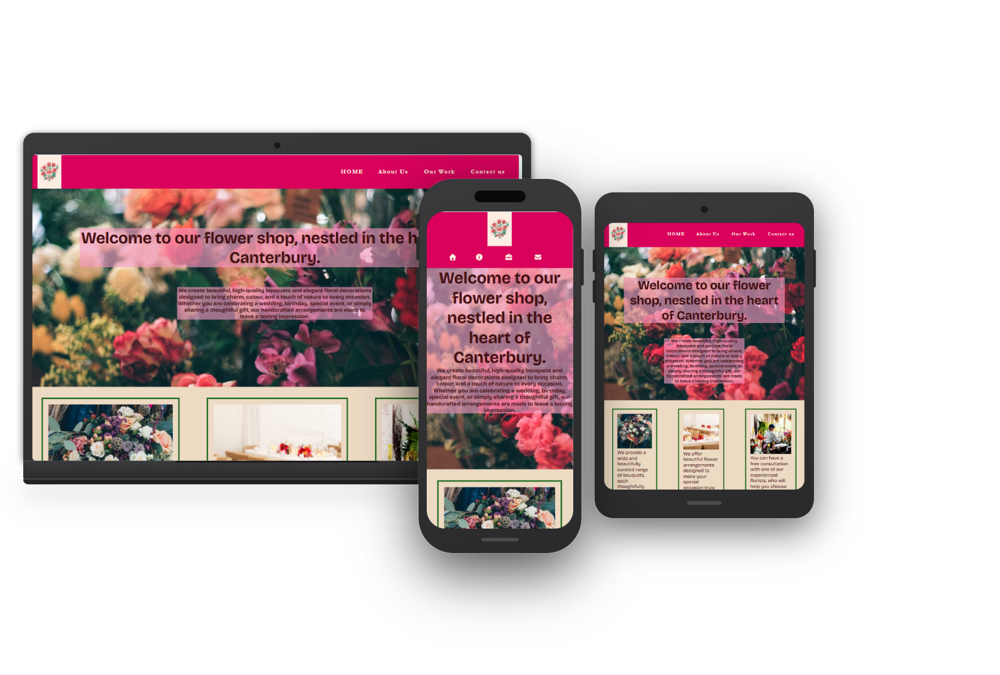
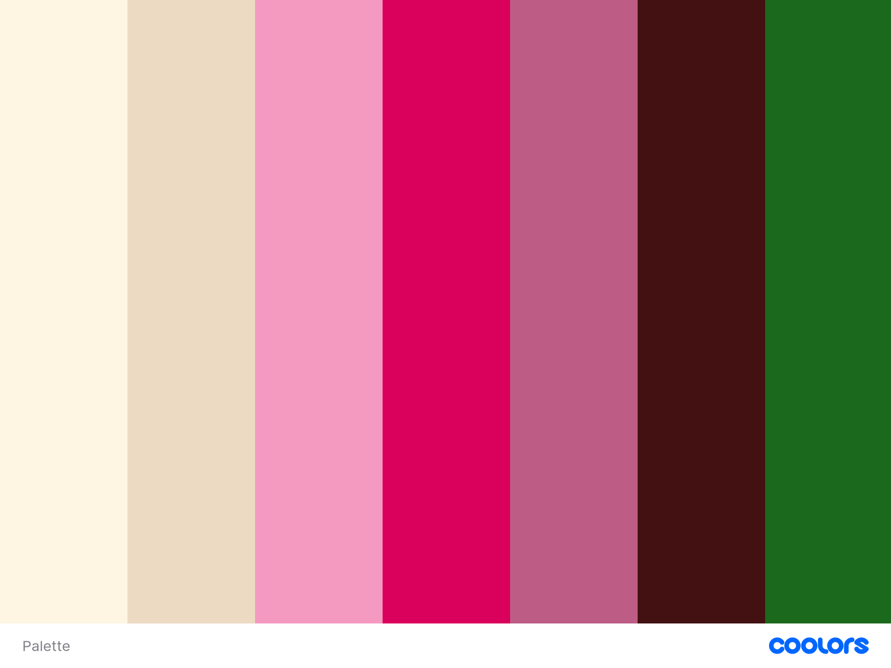
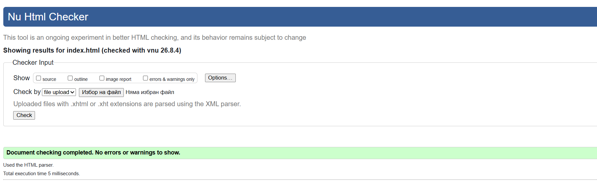
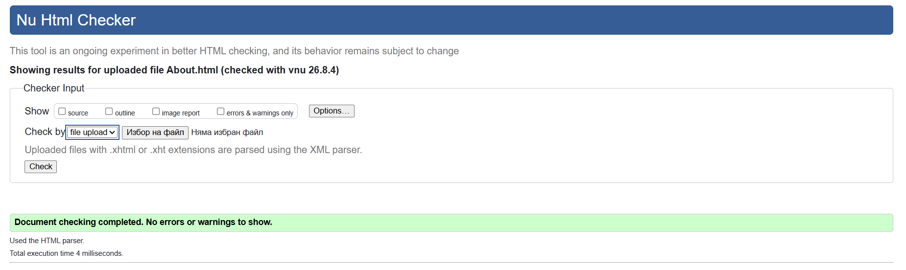
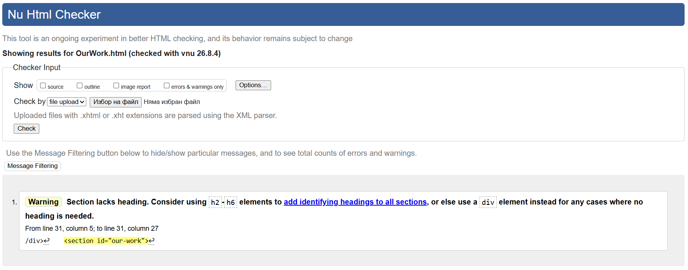
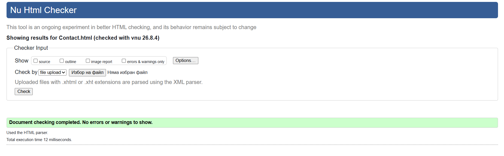

# Flower Shop in Canterbury 
# UX
## Project Goals

The objective of this project is to design and develop a professional website for a flower shop based in Canterbury. The website will showcase the shop's floral services, including custom flower arrangements and bouquets, while providing visitors with information about the business, its history, portfolio, and contact details.



### Key Objectives

* Develop a visually appealing website featuring a floral-inspired design with high-quality images and colourful backgrounds that reflect the beauty and creativity of the shop's work.
* Present the flower shop's history, services, and portfolio to build credibility and help potential customers understand the business and its expertise.
* Create an engaging user experience that inspires customers when planning weddings, celebrations, and other special events by showcasing a range of floral arrangements.
* Include an easy-to-use contact form that allows customers to submit enquiries and select the relevant category, such as event flower arrangements, bouquet orders, or general enquiries.

## Project structure

```text
Flower Shop/
├── index.html               # Home page
├── about.html               # About us page
├── our-work.html            # Gallery page
├── contact.html             # Contact page
│
├── assets/
│   ├── mobile-nav-icons/    # Icons for mobile navigation menu
│   ├── our-work-images/     # Images displayed in the Our Work section
│   └── readme-images/       # Screenshots used in README documentation
│
└── README.md                # Project documentation
```
## Technologies used
- HTML
- CSS


## User Stories
### User Story - History of the shop (Must Have)

As a website visitor, I want to read about the flower shop's history so that I can learn about the business, understand its experience, and feel confident in choosing its services.

* A dedicate section available from the main navigation.
* The page provides information about the flower shop's background, values, and experience.
* The content is easy to read and visually appealing.

### User Sory - Contact Form (Must Have)

As a potential customer, I want to use a contact form to send an enquiry so that I can easily ask questions or request information about flower arrangements and services.

* A contact form is available from the website's navigation or contact page.
* Users can enter their name, email address, subject, and message as a required fields before validation.
* Users can select an enquiry category (e.g., event flower arrangements, bouquet orders, or general enquiries).
* A confirmation message is displayed after successful submission.

### User Story – Business Information (Must Have)

As a customer, I want to view the flower shop's address, opening hours, and social media links so that I can visit the shop, know when it is open, and stay connected with the business online.

* The website displays the flower shop's full address.
* Opening hours are clearly listed and easy to read.
* Social media links are visible and direct users to the shop's official profiles.
* The information is accessible from the website footer.

### User Story 3 (Should Have)

As a first-time visitor, I want to see a welcoming message on the home page so that I immediately understand the flower shop's purpose and feel encouraged to explore the website.

* A welcoming message is displayed prominently on the home page.
* The message briefly introduces the flower shop and its services.
* The content is friendly, engaging, and reflects the brand's personality.
* The welcome message is clearly readable on both desktop and mobile devices.

## Desing Choises

### Color Choice
The colour scheme for the website has been selected to reflect the natural beauty of flowers. A palette inspired by a variety of floral colours is complemented by green accents, representing the stems and vines of flowers.

#### Color Pallete



### Fonts 

* Primary font for the content and heading is Bricolage Grotesque. This font was chosen for its distinctive and bold appearance which reflects the creativity and individuality of floral design.
* Navigation font is Garamont as more readable and ellegant appearance.

### Backgrounds

A floral background was implemented on each page to align with the primary color palette of the header and the overall website, ensuring a consistent and cohesive visual design across the application.

### Styling

The website maintains a consistent visual style while incorporating page-specific design elements. The Home page features a welcome section with a transparent overlay positioned over a background image, along with green-bordered cards inspired by floral vines. The About Us page uses rounded pink-bordered cards to distinguish its content while maintaining design consistency, with all cards aligned in a responsive horizontal layout.

## Debugging 

#### About us Page
Initial Layout consisted a background image with a semi-transparent black overlay. The structure used a two-column flexbox where the left column was left empty to offset the content, while the right column houses three paragraphs of company information. Each paragraph was wrapped in a distinct container element styled with a custom background and border. This layout did not provide the desired user experience across either larger screens or mobile devices. To improve responsiveness, visual consistency, and overall presentation, I decided to redesign the page structure.
##### The old design look:
| | | |
|---|---|---|
|  |  |  |

##### New design styles:
 - New layout begins with a prominent main heading (H1) accompanied by a brief introductory section. It is has set height of 150px. 
 - Below this, three key information cards present the company's core details.
 - The cards are arranged using a Flexbox layout, with each card containing an image positioned above its content. 
 - To ensure a balanced and professional appearance, all cards maintain consistent dimensions of 28rem in **min-width** and **min-height** as well as **auto height and width** for responsive design, with justify-content: space-evenly used to distribute them evenly across the available space.
 - Each paragraph sections has a transparent blur background in order to have contrast of the image background. 

 #### Our Work Page
The gallery is constructed using a Flexbox layout displaying twelve high-quality images distributed evenly across four rows, with each item set to a width of approximately 33%. The images are configured with relative positioning and a constrained height of 150px. For the visual styling, a specific border-radius of 0 0 25% 10% is applied, giving the corners of each image plac an asymmetrical curve. Tjis caused me alot of difficulties to style it and didn't appear as I expected. This DOM hierarchy introduced severe layout issues: 
  - Images became distorted on large monitors 
  - Shrunk down too small on mobile screens
  - Gallery was difficult to navigate.
To solve this problem I changes the whole layout. 
 - All image assets were moved directly into a single parent container
 - The layout was transitioned to a native CSS Column layout engine. 
 - Instead of using text-based layout overrides like line-height and line-gap to force image alignment, the spacing was resolved cleanly using native column property configurations all differ depending on the screen size: 
    - Larger screen: column-count of 4
    - Tablets: column-count of 3
    - Mobile: column-count of 1

#### Media query
##### Mibile devides of max-width:576px
 - Refactored responsive image handling by migrating inline HTML dimensions to CSS, applying a max-width: 100% and height: auto rule to resolve mobile layout breaking. 
 - Updated the header configuration to use a Flexbox column layout, and refactored the navigation bar by setting font-size: 0 to hide text labels in favor of icon fonts, which now match the cohesive nav and footer color palette. The icons did't appear big enought and seems Contact icon pop on the next line. To fix this issue I added:
    - Increased size from 18px to 24px.
    - Added flex-wrap: nowrap, justify-content in the center with 100% width.
    - Logo is aligned-self in center.
###### Home page
 - Optimized the Home page services layout for mobile responsiveness; using a max-width: 576px media query, the grid system was switched from a row layout to a stacked column layout to prevent horizontal overflow on smaller viewports.
 - The position of #main-h1 on laptop was styled with width,left,top proeprties. This caused overflow to mobile. I put same properies back to width:100% and left and top to auto, so it looks better on mobile.
 ###### Contact Form
 The form layout was breaking on mobile viewports because the textarea element was overflowing its parent container. The overflow issue was resolved  by explicitly defining the width and height properties for the mobile breakpoint. Additionally, I applied box-sizing: border-box to ensure that any padding or borders are contained within the declared dimensions, preventing further layout breakage.
 - For more depth, the form and thank you message got box shadow propery with 13px 16px 20px 0px #d9015c.

## Credits

### Code

Codes for nav bar are replaced from text on larger screen view to icons on mobile screen view with the help of VS Code imported AI tool. 
Those codes are:
```css 
.home {
    display: inline-flex;
    align-items: center;
    font-size: 0;
  }
  .home::before {
    content: '';
    display: inline-block;
    width: 24px;
    height: 24px;
    background-image: url('assets/mobile-nav-icons/home.png');
    background-size: contain;
    background-repeat: no-repeat;
    background-position: center;
    margin-right: 5px;
  }
  .about {
    display: inline-flex;
    align-items: center;
    font-size: 0;
  }

  .about::before {
    content: '';
    display: inline-block;
    width: 24px;
    height: 24px;
    background-image: url('assets/mobile-nav-icons/about.png');
    background-size: contain;
    background-repeat: no-repeat;
    background-position: center;
    margin-right: 5px;
  }

  .our-work {
    display: inline-flex;
    align-items: center;
    font-size: 0;
  }

  .our-work::before {
    content: '';
    display: inline-block;
    width: 24px;
    height: 24px;
    background-image: url('assets/mobile-nav-icons/work.png');
    background-size: contain;
    background-repeat: no-repeat;
    background-position: center;
    margin-right: 5px;
  }

  .contact {
    display: inline-flex;
    align-items: center;
    font-size: 0;
  }

  .contact::before {
    content: '';
    display: inline-block;
    width: 24px;
    height: 24px;
    background-image: url('assets/mobile-nav-icons/envelope.png');
    background-size: contain;
    background-repeat: no-repeat;
    background-position: center;
    margin-right: 5px;
  }
  ```

### Images
Images for both gallery and backgrounds were found and imported from following websites:

https://unsplash.com/
https://www.pexels.com/

### Mobile Icons
Icons used for the nav bar in movile version were downloaded from https://fontawesome.com/

## Deployment

Website was build using VS Code and each update was commited onto GitHUb website. To find and run you should follow the steps bellow:
- Open https://github.com/vanesaivch/ which is the direct link to the profile.
- Open the repository names **my-first-project**
- On the right hand side, you can find **Deployments** section
- After you click **Deployments**, the link will appear.

## Testing details

### Validator testing
Each page was tested with w3c validator. There was few issues to resolve:
- **Home page** pictures were missing an *alt* attribute.



- **About Us** page had *img* elements with a closing tags. All was removed and fixed as a self-closing element.

- **Our Work** page lacks a h2-h6 headings. Dues to its layout, there is no need of headitngs other than a h1.


- **Send message** logo had set *width* and *height* directly into HTML file and id was missing. Added logo id as it is on the other pages and removed *width* and *height* attributes.


### User stories testing

#### History of the shop
 - The **About Us** and **Our Work** pages were implemented to highlight the owners' history, experience, and mission. 
 - Both pages are accessible through the website's navigation bar, ensuring users can easily explore the brand's story, values, and creative process.

#### Contact form
 - Contact form has been clearly marked into separeta page, which is accesible through the main nav bar menu.

#### Bussiness information
 - All essential business information is permanently visible and easily accessible throughout the website, ensuring users can quickly find the details they need without unnecessary navigation.
 - The website footer includes the company's complete contact information, including its physical address and links to its social media profiles.

 #### Welcoming message

 - On the home page, each visitor is welcomed with a short message and brief information of the website content.


