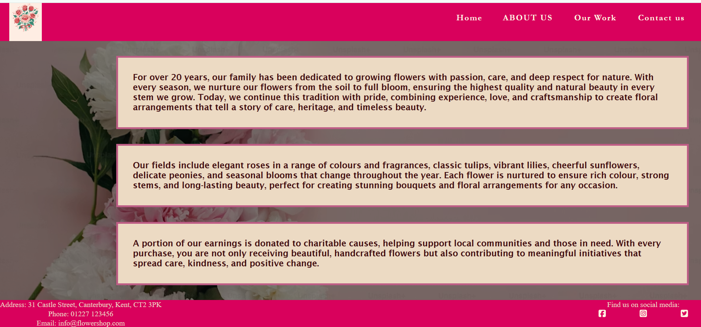
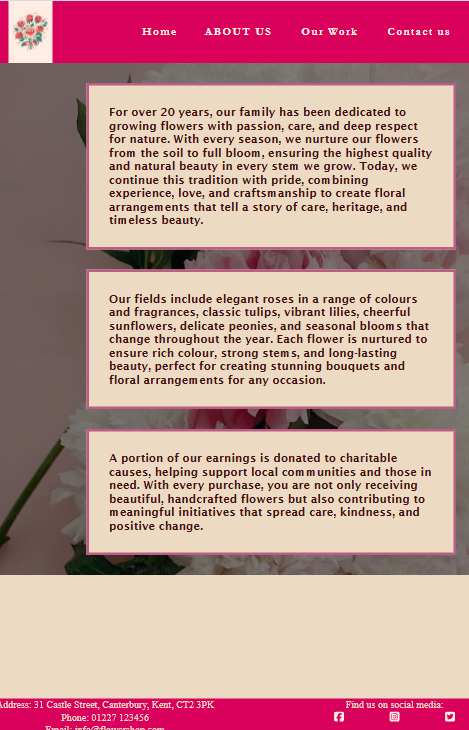
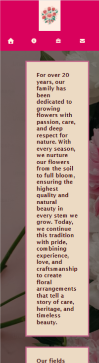

# Flower Shop in Canterbury 
# UX
## Project Goals

The objective of this project is to design and develop a professional website for a flower shop based in Canterbury. The website will showcase the shop's floral services, including custom flower arrangements and bouquets, while providing visitors with information about the business, its history, portfolio, and contact details.

### Key Objectives

* Develop a visually appealing website featuring a floral-inspired design with high-quality images and colourful backgrounds that reflect the beauty and creativity of the shop's work.
* Present the flower shop's history, services, and portfolio to build credibility and help potential customers understand the business and its expertise.
* Create an engaging user experience that inspires customers when planning weddings, celebrations, and other special events by showcasing a range of floral arrangements.
* Include an easy-to-use contact form that allows customers to submit enquiries and select the relevant category, such as event flower arrangements, bouquet orders, or general enquiries.

## User Stories
### User Story - History of the shop (Must Have)

As a website visitor, I want to read about the flower shop's history so that I can learn about the business, understand its experience, and feel confident in choosing its services.

* A dedicate section available from the main navigation.
* The page provides information about the flower shop's background, values, and experience.
* The content is easy to read and visually appealing.

### User Sory - Contact Form (Must Have)

As a potential customer, I want to use a contact form to send an enquiry so that I can easily ask questions or request information about flower arrangements and services.

* A contact form is available from the website's navigation or contact page.
* Users can enter their name, email address, subject, and message as a required fields before validation.
* Users can select an enquiry category (e.g., event flower arrangements, bouquet orders, or general enquiries).
* A confirmation message is displayed after successful submission.

### User Story – Business Information (Must Have)

As a customer, I want to view the flower shop's address, opening hours, and social media links so that I can visit the shop, know when it is open, and stay connected with the business online.

* The website displays the flower shop's full address.
* Opening hours are clearly listed and easy to read.
* Social media links are visible and direct users to the shop's official profiles.
* The information is accessible from the website footer.

### User Story 3 (Should Have)

As a first-time visitor, I want to see a welcoming message on the home page so that I immediately understand the flower shop's purpose and feel encouraged to explore the website.

* A welcoming message is displayed prominently on the home page.
* The message briefly introduces the flower shop and its services.
* The content is friendly, engaging, and reflects the brand's personality.
* The welcome message is clearly readable on both desktop and mobile devices.


## Features
Website is build with responsive design for different devices, contact form, company's work and history and avaiable services.
## Planing
I chose the topic of flowers because they offer a wide variety of colours, shapes, and textures that can be combined to create visually appealing designs. The diverse colour combinations and high-quality floral images make it possible to design an attractive and engaging website with a welcoming atmosphere. Flowers also provide inspiration for elegant layouts and creative styling, allowing the website to showcase products in a way that captures the attention of visitors.

## Project structure

```text
Flower Shop/
├── index.html               # Home page
├── about.html               # About us page
├── our-work.html            # Gallery page
├── contact.html             # Contact page
│
├── assets/
│   ├── mobile-nav-icons/    # Icons for mobile navigation menu
│   ├── our-work-images/     # Images displayed in the Our Work section
│   └── readme-images/       # Screenshots used in README documentation
│
└── README.md                # Project documentation
```

## Development Process
### Color Palette
* **Cream:** $${\color{#FEF5E2}\blacksquare}$$ `#FEF5E2`
* **Tan:** $${\color{#ECDAC3}\blacksquare}$$ `#ECDAC3`
* **Pastel Pink:** $${\color{#F49AC1}\blacksquare}$$ `#F49AC1`
* **Magenta:** $${\color{#D9015C}\blacksquare}$$ `#D9015C`
* **Muted Rose:** $${\color{#BD5D85}\blacksquare}$$ `#BD5D85`
* **Maroon:** $${\color{#441113}\blacksquare}$$ `#441113`
* **Forest Green:** $${\color{#1B691C}\blacksquare}$$ `#1B691C`
 


### General Styles
All pages have:
- Box-sizing of border-box
- Margina and padding set to 0
- Main colors of the body are:   
background-color: #ecdac3;
  color: #441113;
- Main content of all pages is in flexbox in order to push the footer to the bottom of it.
- font- family is Bricolage Grotesque 
### Header and Footer
Both Header and Footer has same color for background #d9015c, text #fef5e2 and hover (hsl(121, 59%, 26%))  
#### Header
The header contains the company logo positioned on the left and a navigation bar aligned to the right with links to the four main pages of the website.

When choosing the logo, I used colours from the website’s chosen colour palette to maintain a cohesive and professional visual identity throughout the site. 

Each navigation item is wrapped in an anchor element. Each anchor has letter spacing of 2px and padding of 20px. To improve usability and provide visual feedback, I added a hover effect that changes the colour of the links when the user moves the mouse over them. I also styled the active page link so that its text is displayed in uppercase.
#### Footer
The footer includes the flower shop’s address, contact details, and links to its social media profiles.

The layout of the footer was built using CSS Flexbox with address on the left and social media networks on the right

For the social media links, I used font awesome icons elements to display icons representing each platform, such as Facebook, Instagram, and Twitter.

#### Home Page
The Home page is divided into two main sections.
The first section features a welcoming message that greets users when they visit the website. It includes a brief introduction to the flower shop. It is wrpaed in a div with h1 and p. There is background image with height of 585px. H1 and p text is in color #fef5e2 and has its own transparent background in color hsla(334, 80%, 78%, 0.522) so it can be fully readeble. As the text wasn't looking well enough, I added relative position to both h1 and p. H1 have width of 80% with left:10% and top:20%, and p have width of 40% with left of 30% and top of 30%. This made it stays more cerntal of the page.

The second section focuses on the services offered by the shop. It provides a concise description of the different floral services available. There are 3 div in flex row with images and border in color hsl(121, 59%, 26%) solid 4px. This color is the same as hover on header and footer. As well as choosen font family is "Lucida Sans", "Lucida Sans Regular", "Lucida Grande", "Lucida Sans Unicode", Geneva, Verdana, sans-serif. There is a hover property with scale(1.05).

#### About us Page
The layout for the "About Us" page consists of a background image with a semi-transparent black overlay for high readability. The structure uses a two-column flexbox where the left column is left empty to offset the content, while the right column houses three paragraphs of company information. Each paragraph is wrapped in a distinct container element styled with a custom background and border, creating a clean, right-aligned block of text cards.
Colors are inherited of body styles but additional are added on parapgraphs border as #bd5d85 solid 4px
The previous layout did not provide the desired user experience across either larger screens or mobile devices. To improve responsiveness, visual consistency, and overall presentation, I decided to redesign the page structure.

##### The old design look:
| | | |
|---|---|---|
|  |  |  |

 - New layout begins with a prominent main heading (H1) accompanied by a brief introductory section. It is has set height of 150px. 
 - Below this, three key information cards present the company's core details.
 - The cards are arranged using a Flexbox layout, with each card containing an image positioned above its content. 
 - To ensure a balanced and professional appearance, all cards maintain consistent dimensions of 28rem in **min-width** and **min-height** as well as **auto height and width** for responsive design, with justify-content: space-evenly used to distribute them evenly across the available space.
 - Each paragraph sections has a transparent blur background in order to have contrast of the image background. 

#### Our Work
The gallery is constructed using a Flexbox layout displaying twelve high-quality images distributed evenly across four rows, with each item set to a width of approximately 33%. The images are configured with relative positioning and a constrained height of 150px. For the visual styling, a specific border-radius of 0 0 25% 10% is applied, giving the corners of each image plac an asymmetrical curve. Tjis caused me alot of difficulties to style it and didn't appear as I expected. This DOM hierarchy introduced severe layout issues: 
  - Images became distorted on large monitors 
  - Shrunk down too small on mobile screens
  - Gallery was difficult to navigate.
To solve this problem I changes the whole layout. 
 - All image assets were moved directly into a single parent container
 - The layout was transitioned to a native CSS Column layout engine. 
 - Instead of using text-based layout overrides like line-height and line-gap to force image alignment, the spacing was resolved cleanly using native column property configurations all differ depending on the screen size: 
    - Larger screen: column-count of 4
    - Tablets: column-count of 3
    - Mobile: column-count of 1

#### Contact us
 - The contact page hosts a centrally aligned form component split into two logical fieldsets: "Your Details" and "Your Enquiry." The first section contains standard text inputs for name, email, and telephone, while the second section includes a select option dropdown for the inquiry type, a textarea for the message body, and a submit button. Upon successful form submission, the application routes the user to a standard confirmation "Thank You" view.
 - The Contact form is placed inside a Flexbox container, which allows it to be centered  using justify-content: center and align-items: center. The container spans the full width  of the viewport, ensuring the form remains centered regardless of screen size. 
 - A background image is applied to the container to create a visually appealing backdrop. The form itself features a semi-transparent background with a backdrop-filter: blur(...) effect. Rounded corners are added with border-radius to create a modern and polished design.


#### Media query
##### Mibile devides of max-width:576px
 - Refactored responsive image handling by migrating inline HTML dimensions to CSS, applying a max-width: 100% and height: auto rule to resolve mobile layout breaking. 
 - Updated the header configuration to use a Flexbox column layout, and refactored the navigation bar by setting font-size: 0 to hide text labels in favor of icon fonts, which now match the cohesive nav and footer color palette. The icons did't appear big enought and seems Contact icon pop on the next line. To fix this issue I added:
    - Increased size from 18px to 24px.
    - Added flex-wrap: nowrap, justify-content in the center with 100% width.
    - Logo is aligned-self in center.
###### Home page
 - Optimized the Home page services layout for mobile responsiveness; using a max-width: 576px media query, the grid system was switched from a row layout to a stacked column layout to prevent horizontal overflow on smaller viewports.
 - The position of #main-h1 on laptop was styled with width,left,top proeprties. This caused overflow to mobile. I put same properies back to width:100% and left and top to auto, so it looks better on mobile.
 ###### Contact Form
 The form layout was breaking on mobile viewports because the textarea element was overflowing its parent container. The overflow issue was resolved  by explicitly defining the width and height properties for the mobile breakpoint. Additionally, I applied box-sizing: border-box to ensure that any padding or borders are contained within the declared dimensions, preventing further layout breakage.
 - For more depth, the form and thank you message got box shadow propery with 13px 16px 20px 0px #d9015c.
## Technologies used
- HTML
- CSS
## Instalation
1. Repository:
```bash
https://vanesaivch.github.io/my-first-project/
```
2. Project folder:
```bash
main
```
## Usage

<!-- Finish Section -->


## Screenshots

<!-- Finish Section -->

## Live Demo
<!-- Finish Section -->


